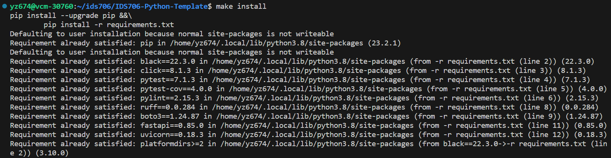
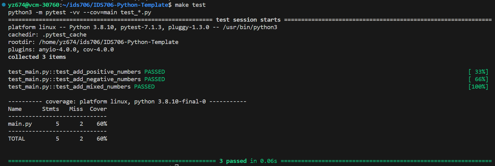
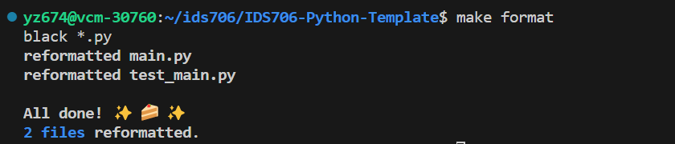
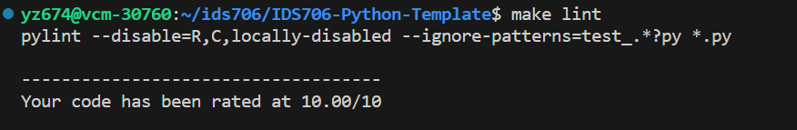

# IDS706-Python-Template

Python template repo for Fall 2023 IDS_706-Data Engineering Systems at Duke Univ. 

It contains:

- ``.devcontainer`` includes a `Dockerfile` that specifies the configurations of container, and a `devcontainer.json` which is a configuration file used in the context of Visual Studio Code

- ``workflows`` includes `GitHub Actions`, enables automated build, test and deployment for the project

- ``Makefile`` specifies build automation on Linux

- ``requirements.txt`` lists the dependencies, libraries, and specific versions of Python packages required for the project

It also includes ``main.py`` and ``test_main.py`` as sample files to show the functionality of the CI pipeline.

## Github Actions Demo

`Github Actions` is configured to kick off workflows with Github events. Below shows some samples:

