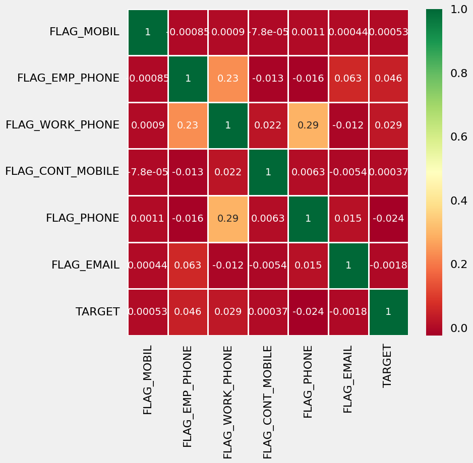
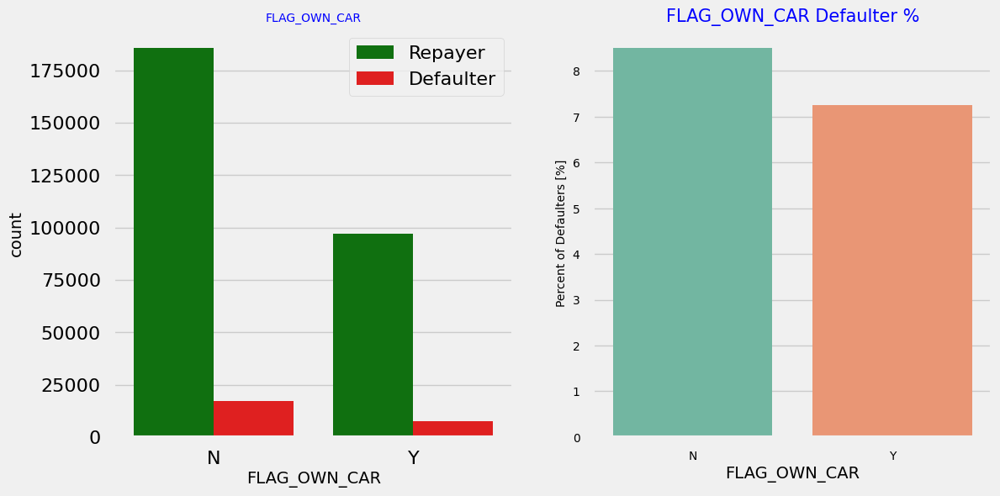
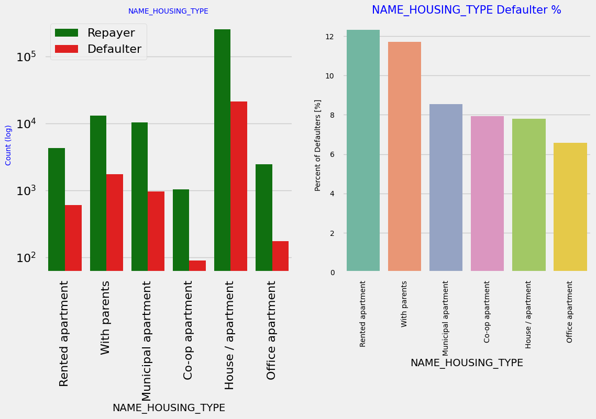
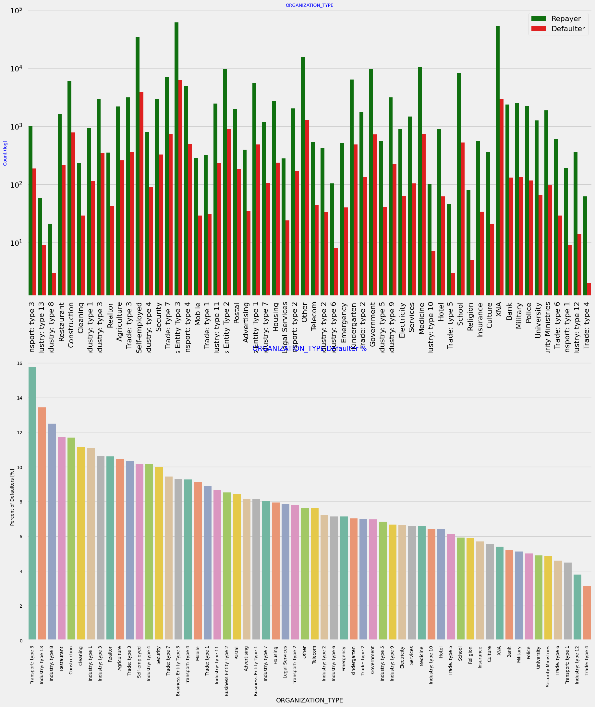
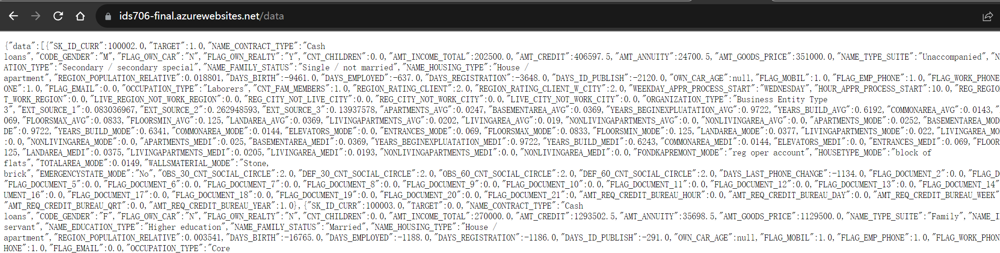
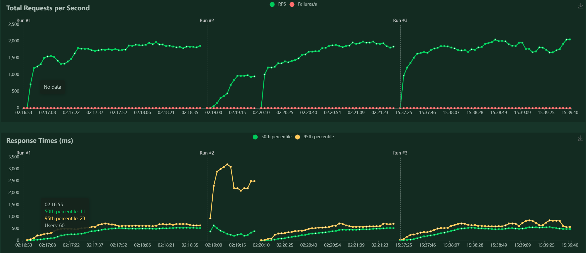
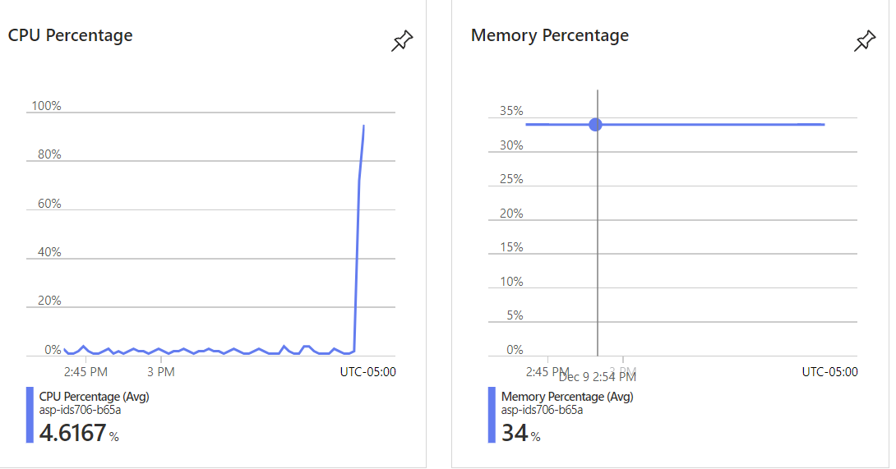
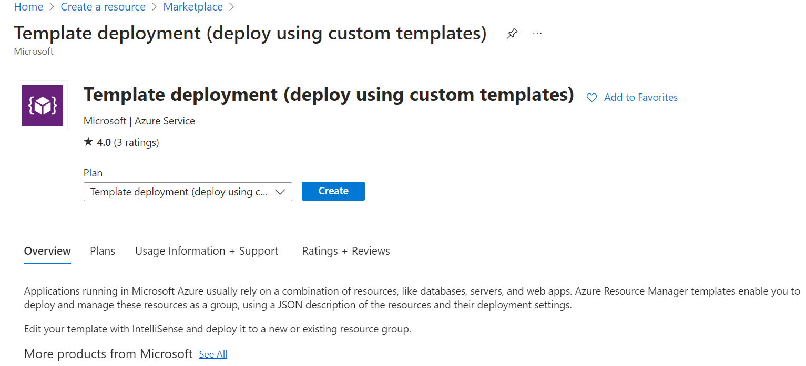

[](https://github.com/nogibjj/IDS706_Fall2023_Final_Team_Project/actions/workflows/install.yml)
[](https://github.com/nogibjj/IDS706_Fall2023_Final_Team_Project/actions/workflows/lint.yml)
[](https://github.com/nogibjj/IDS706_Fall2023_Final_Team_Project/actions/workflows/format.yml)
[](https://github.com/nogibjj/IDS706_Fall2023_Final_Team_Project/actions/workflows/test.yml)
# IDS706 Fall 2023 Final Project

Team members: 
- **Yuchen Zhang** (yz674) 
- **Xuesen Wen** (xw202) 
- **Yuhan Xue** (yz167) 
- **Rui Chen** (rc381) 
- **Junhan Xu** (jx139)

This repository hosts the **IDS706-Data Engineering Systems Fall 2023 Final Project**, encompassing various components:

- ``Data Engineering Pipeline``: The core of the project, encapsulated in the **Jupyter Notebook** named ``eda-bank-loan-default-risk-analysis.ipynb``. This notebook comprehensively outlines the **Extract, Transform, and Load (ETL)** process applied to analyze bank loan data. Given the dataset's size and computational demands, the notebook is executed on the **Azure Databricks** platform for optimal performance.

- ``Microservice``: Serves as the interface between users and the data pipeline, implemented in ``app.py`` using **FastAPI**. The microservice, deployed on **Azure App Service**, simplifies interaction with the **Azure SQL database** through HTTP requests. **Auto-scaling** is facilitated by Azure App Service, enhancing application availability.

- ``Container Configuration``: The ``Dockerfile`` details the process of building a **Docker container** compatible with the microservice's runtime environment. Note the importance of including ``driver.sh`` within the container, as the ``msodbcsql18`` driver requires separate installation for interaction with the **Azure SQL database**.

- ``Load test``: Utilizes the **Locust** library to conduct load testing on the Azure-deployed microservice. Customizable load configurations and performance visualization are key features.

- ``Continuous Integration and Continuous Delivery (CI/CD)``

- ``GitHub Configurations``

- ``Infrastructure as Code (IaC)``

## Architectural Diagram


## Data Engineering Pipeline: Bank Loan Default Risk Analysis
This pipeline employs EDA on a real-world business scenario using the **loan-defaulter dataset** from ``Kaggle``. The ``eda-bank-loan-default-risk-analysis.ipynb`` notebook, deployed on Azure Databricks, loads and manipulates data using the **Pandas** library. The pipeline comprises several steps:
- ``Load Data``: Imports CSV dataset files, checks dimensions, and inspects columns.
- ``Data cleaning and manupulation``: Removes or interpolates invalid or missing values. Example: Removing low-correlation columns.
    - For example, we remove some of the columns by checking if they have low correlation between them <br>
    
- ``Data Analysis``: Applies various EDA methods, yielding insights. Examples include analyzing the relationship between car ownership and loan repayment status, housing type, and organization type.
    - Analysing if owning a car is related to loan repayment status: Clients who own a car are half in number of the clients who dont own a car. But based on the percentage of deault, there is no correlation between owning a car and loan repayment as in both cases the default percentage is almost same. <br>
    - Analysing housing type based on loan repayment status: Majority of people live in House/apartment; People living in office apartments have lowest default rate; People living with parents (~11.5%) and living in rented apartments(>12%) have higher probability of defaulting <br>
    - Checking loan repayment status based on Organization type: Organizations with highest percent of loans not repaid are Transport: type 3 (16%), Industry: type 13 (13.5%), Industry: type 8 (12.5%) and Restaurant (less than 12%). Self employed people have relative high defaulting rate, and thus should be avoided to be approved for loan or provide loan with higher interest rate to mitigate the risk of defaulting.<br>

## Microservice: FastAPI application
The **FastAPI** library facilitates the creation of a microservice providing HTTP-accessible APIs. This project's microservice, containerized with **Docker**, interfaces with the data engineering pipeline. Key steps include ODBC driver installation, data preparation, and interaction with Azure App Service. It has several steps:
- ``ODBC Driver Installation``: included in ``driver.sh``. **ODBC Driver** is a necessary component for the microservice to interact with **Azure SQL database**.
- ``Data Preparation``: included in ``data_prepare.py``. It reads datasets from **Azure Blob Storage** to **pandas dataframe**, then makes use of ``SQLAlchemy`` and ``pyodbc`` to write the data to **Azure SQL databse**.
- ``Azure App Service``: users can reach out to the service via the public domain provided by ``Azure App Service`` and get the results of SQL queries, for example, this route simply returns all the rows in the database:<br>
- ``Load Test``: Note that **Azure App Service** automatically scale up based on the amount of user requests. We use ``locust`` to simulate concurrent user requests to apply load test to the microservice. It turns out that the result of load test is restricted by the performance of **Azure VM** - the VM has ``4 vCPUs`` and ``16GB`` RAMs, and we enabled ``multi-core mode`` of ``locust``, but the peak **RPS (requests per second)** is around **2000**. We can tell that the bottlenect was not on Azure App Service but was on Azure VM because the CPU percentage and memory percentage of the application is quite low when the load test is running, as shown below:
<br><br>

## Miscellaneous
- ``Infrastructure as Code (IaC)``: We make use of ``Azure Resource Manager (ARM)`` templates to deploy the **Azure App**. Specifically, we added customized template to ``Azure Portal``: 
```json
{
    "$schema": "https://schema.management.azure.com/schemas/2019-04-01/deploymentTemplate.json#",
    "contentVersion": "1.0.0.0",
    "parameters": {
        "name": {
            "type": "string"
        },
        "location": {
            "type": "string"
        }
    },
    "resources": [
        {
            "type": "Microsoft.Web/sites",
            "apiVersion": "2018-11-01",
            "name": "[parameters('name')]",
            "location": "[parameters('location')]",
            "kind": "app",
            "properties": {
                "serverFarmId": "[resourceId('Microsoft.Web/serverfarms', parameters('name'))]"
            }
        },
        {
            "type": "Microsoft.Web/serverfarms",
            "apiVersion": "2018-02-01",
            "name": "[parameters('name')]",
            "location": "[parameters('location')]",
            "sku": {
                "name": "F1",
                "capacity": 1
            }
        }
    ]
}
```
<br>
- ``Continuous Integration and Continuous Delivery (CI/CD)``: enabled by **GitHub Actions** defined in ``.github/workflows``
- ``GitHub Configurations``: enabled in ``.devcontainer`` configurations for ``GitHub Codespaces``, making the local version of project completely reproducible
- ``Quantitative Assessment``: see the ``Load Test`` part of ``Microservice`` content above

---------

**These represent the concluding lines of code that Yuchen composes as he concludes his M.S. ECE** **program at Duke. The remarkable journey he embarked on since August 2020 will forever be etched in** 
**his memory. Yuchen expresses sincere gratitude to the outstanding teaching faculty and classmates** **who played a pivotal role in shaping him into an improved software engineer and, above all, a** **better individual.** - Dec 9, 2023
